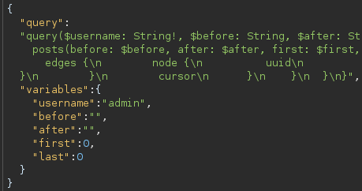
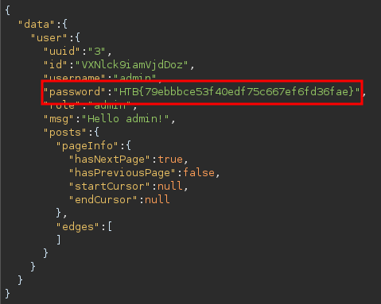

# Insecure Direct Object Reference (IDOR)

## Procedencia

| Repositorio | Archivo original | Commit de origen |
| --- | --- | --- |
| CBBH | Attacking GraphQL/2- Insecure Direct Object Reference (IDOR).md | 284a0a42d23a00f2b47b7460371a517a14cb6261 |

[Índice de categoría](../README.md) · [Inicio](../../README.md)
