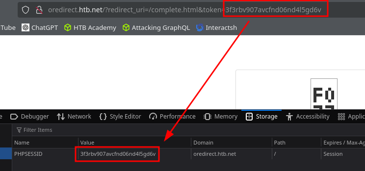

# Session Fixation

An attacker could send a URL similar to the above to a victim. If the victim logs into the application, the attacker could easily hijack their session since the session identifier is already known (the attacker fixated it).

## Procedencia

| Repositorio | Archivo original | Commit de origen |
| --- | --- | --- |
| CBBH | 17-Session Security/2 - Session Fixation.md | 284a0a42d23a00f2b47b7460371a517a14cb6261 |

[Índice de categoría](../README.md) · [Inicio](../../README.md)
