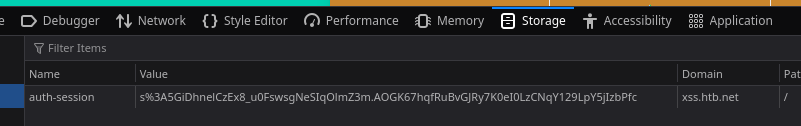

# Session Hijacking

Replace the value of the `auth-session` cookie. Reload the page, and you will notice that you are logged in without using any credentials.

## Procedencia

| Repositorio | Archivo original | Commit de origen |
| --- | --- | --- |
| CBBH | 17-Session Security/1 - Session Hijacking.md | 284a0a42d23a00f2b47b7460371a517a14cb6261 |

[Índice de categoría](../README.md) · [Inicio](../../README.md)
