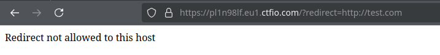
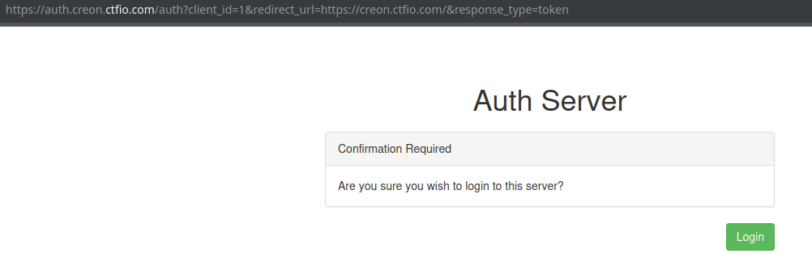
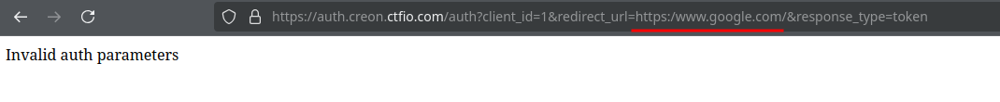
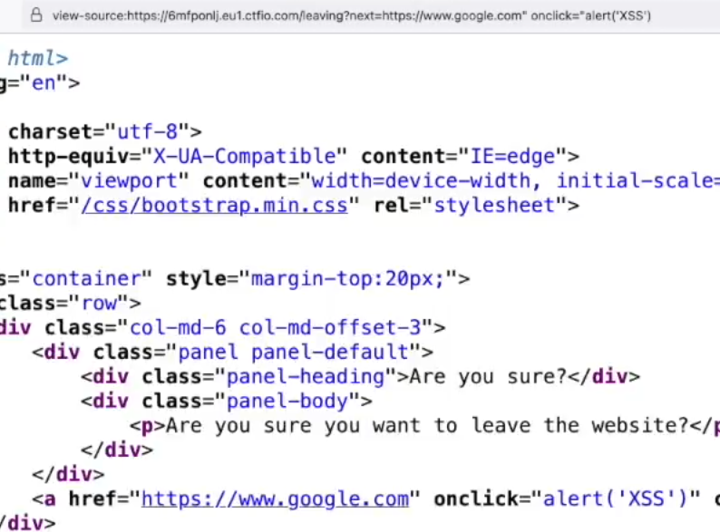

# Open Redirect (HackingHub)

https://github.com/payloadbox/open-redirect-payload-list

```html
<a href="/?redirect=http://www.google.com">Google</a>
```

## Bypassing protections



```text
?redirect=http://www.google.com.test
```

## SSO Example





```text
https://auth.creon.ctfio.com/auth?client_id=1&redirect_url=https://creon.ctfio.com/redirect?url=https://www.google.com&response_type=token
```

## Protections

Regex looking for //
```text
https://auth.icarus.ctfio.com/auth?client_id=1&redirect_url=https://icarus.ctfio.com/x//www.google.com&response_type=token
```

Use the domain before the `@` as a fake username to redirect to the domain after the `@`

```text
https://auth.daedalus.ctfio.com/auth?client_id=1&redirect_url=https://redacted@example.invalid/&response_type=token
```

## XSS


