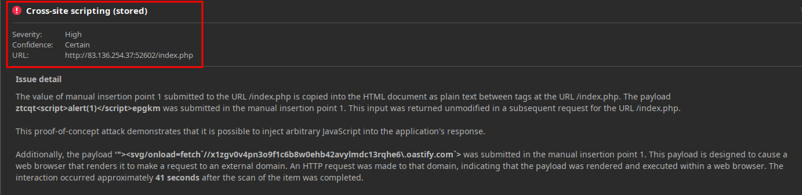
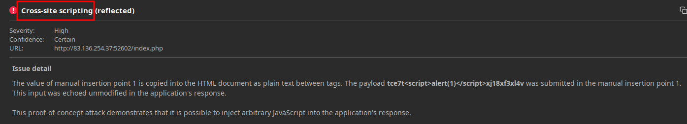

# XSS

## Stored & Reflected

```html
<script>alert(document.cookie)</script>
```





## DOM 

Some of the commonly used JavaScript functions to write to DOM objects are:

- `document.write()`
- `DOM.innerHTML`
- `DOM.outerHTML`

Furthermore, some of the `jQuery` library functions that write to DOM objects are:

- `add()`
- `after()`
- `append()`

```html

```


## Automated Discovery

https://github.com/s0md3v/XSStrike

Burp scanner

*Captura omitida por posibles datos sensibles.*
## Payloads

https://github.com/swisskyrepo/PayloadsAllTheThings/blob/master/XSS%20Injection/README.md
https://github.com/payloadbox/xss-payload-list
